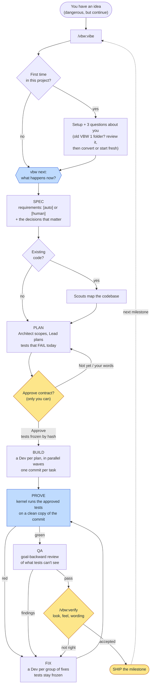

<div align="center">

# Vibe Better With Claude Code - VBW

*You're not an engineer anymore.*

*You're a prompt jockey with commit access.*

*At least do it properly.*


[](LICENSE)
[](https://code.claude.com)
[](https://anthropic.com)
[](https://discord.gg/zh6pV53SaP)

</div>

## VBW 2 Is a Complete Rewrite

VBW 1 taught Claude Code to plan, build and verify. It worked. Mostly. The trouble with "verify" is that the thing doing the verifying was the same thing that wrote the code, and it had every reason to be generous.

VBW 2 starts over from one idea: **done is something a program checks, not something the assistant claims.** You agree on what to build. Every requirement gets a test, written before the code, that fails today. You approve, and the tests are frozen. Agents build in parallel. Then a small kernel runs the approved tests itself, on a clean copy of the committed code, and marks a requirement done only when they pass. What only a person can judge (how it looks, how it feels, whether the copy is cringe) stays with you.

Same name. Same command. Different species.

## Token Efficiency

### VBW 1.x vs Stock Opus 4.6 Agent Teams

*These are VBW 1 measurements, kept for the record. VBW 2 shares none of that code, so none of these numbers describe it.*

Every VBW 1 capability was shell-only: 85 scripts ran as bash subprocesses at zero model token cost. The codebase grew 42% since v1.21.30 while per-request overhead grew just 12% (still 7% below v1.20.0). 845 bats tests validated the stack.

**Analysis reports:** [v1.30.0](https://github.com/swt-labs/vibe-better-with-claude-code-vbw/blob/main/docs/vbw-1-30-0-full-spec-token-analysis.md) | [v1.21.30](https://github.com/swt-labs/vibe-better-with-claude-code-vbw/blob/main/docs/vbw-1-21-30-full-spec-token-analysis.md) | [v1.20.0](https://github.com/swt-labs/vibe-better-with-claude-code-vbw/blob/main/docs/vbw-1-20-0-full-spec-token-analysis.md) | [v1.10.7](https://github.com/swt-labs/vibe-better-with-claude-code-vbw/blob/main/docs/vbw-1-10-7-context-compiler-token-analysis.md) | [v1.10.2](https://github.com/swt-labs/vibe-better-with-claude-code-vbw/blob/main/docs/vbw-1-10-2-vs-stock-agent-teams-token-analysis.md) | [v1.0.99](https://github.com/swt-labs/vibe-better-with-claude-code-vbw/blob/main/docs/vbw-1-0-99-vs-stock-teams-token-analysis.md)

| Category | Stock Agent Teams | VBW 1 | Saving |
| :--- | ---: | ---: | ---: |
| Base context overhead | 10,800 tokens | 1,500 tokens | **86%** |
| State computation per command | 1,300 tokens | 200 tokens | **85%** |
| Agent coordination (x4 agents) | 16,000 tokens | 1,200 tokens | **93%** |
| Compaction recovery | 5,000 tokens | 700 tokens | **86%** |
| Context duplication (shared files) | 16,500 tokens | 900 tokens | **95%** |
| Agent model cost per phase | $2.78 | $1.40 | **50%** |
| **Total coordination overhead** | **87,100 tokens** | **12,100 tokens** | **86%** |

| Scenario | Without VBW | With VBW 1 (Balanced) | Impact |
| :--- | ---: | ---: | ---: |
| API: single project (10 phases) | ~$28 | ~$14 | **~$14 saved** |
| API: active dev (20 phases/mo) | ~$56/mo | ~$28/mo | **~$28/mo saved (~$336/yr)** |
| API: heavy dev (50 phases/mo) | ~$139/mo | ~$70/mo | **~$69/mo saved (~$828/yr)** |
| API: team (100 phases/mo) | ~$278/mo | ~$139/mo | **~$139/mo saved (~$1,668/yr)** |
| Pro / Max subscription | baseline capacity | ~3x phases per cycle | **200% more work done** |

*Based on [API pricing](https://claude.com/pricing) at the time of each report.*

### VBW 2.1.0 (coming soon)

> **Placeholder.** The VBW 2 token and cost analysis ships with 2.1.0.

Honesty clause: proof is not free. On tiny one-requirement tasks, VBW 2 currently spends more than plain Claude Code, because writing a test first, getting your approval and re-running everything on a clean copy costs tokens. Plain Claude Code also skips all of that, which is how it saves money and how you end up debugging at 2 a.m. The measured numbers, including the unflattering ones, are in [docs/benchmark.md](docs/benchmark.md). Making proof cheaper is what 2.1.0 is for.

| Category | Plain Claude Code | VBW 2.1.0 | Saving |
| :--- | ---: | ---: | ---: |
| Cost per proven requirement | TBD | TBD | TBD |
| Tokens per phase | TBD | TBD | TBD |
| User inputs per milestone | TBD | TBD | TBD |
| Rework after "done" | TBD | TBD | TBD |

## Manifesto

VBW is open source because the best tools are built by the people who use them.

This project exists to make AI coding better for everyone, and "everyone" means exactly that.

**For absolute beginners:** You don't need to know what a test is. VBW writes them, explains them in your words, and asks you only what a person has to decide. You will ship software that works, and you will have no idea why. That puts you level with most of the industry.

**For seasoned developers:** You already know tests should come first. You've known since 2009. VBW just does it, then refuses to let anyone (including the model, including you at 6 p.m. on a Friday) weaken a test to make it pass. Models, autonomy and rigor are all switches. The beginners get guardrails; you get the switches behind the guardrails.

**For contributors:** The kernel, the workflows, the agents, the guards: all of it is open to improvement. If you've found a better way to prove code with Claude, bring it. File an issue, open a PR, or just show up and share what you've learned.

**[Join the Discord](https://discord.gg/zh6pV53SaP)** -- whether you want to help build VBW or just want VBW to help you build.

## What Is This

> **Platform:** macOS and Linux. Windows is not supported natively: the kernel and the guards are bash. On Windows, run Claude Code inside [WSL](https://learn.microsoft.com/en-us/windows/wsl/install).

VBW is a Claude Code plugin that gives Claude Code an executable definition of done.

You describe what you want. VBW turns it into requirements, writes a failing test for each one, and asks you to approve the lot. Agents build in parallel until their tests pass. A kernel that doesn't care about anyone's feelings runs the tests and records the result. Then you check the parts no test can judge, and ship.

It's the entire software development lifecycle, except the engineering team is a plugin and the QA department is a bash script with trust issues.

Inspired by **[Ralph](https://github.com/frankbria/ralph-claude-code)** and **[Get Shit Done](https://github.com/glittercowboy/get-shit-done)**. Built on neither.

## Table of Contents

- [VBW 2 Is a Complete Rewrite](#vbw-2-is-a-complete-rewrite)
- [Token Efficiency](#token-efficiency)
- [Manifesto](#manifesto)
- [What Is This](#what-is-this)
- [Features](#features)
- [Install](#install)
- [How It Works](#how-it-works)
- [Start](#start)
- [Commands](#commands)
- [The Agents](#the-agents)
- [How It Stays Safe](#how-it-stays-safe)
- [Configuration](#configuration)
- [Project Structure](#project-structure)
- [Requirements](#requirements)
- [Documentation](#documentation)
- [Contributing](#contributing)
- [License](#license)

---

## Features

### Proof, not promises

- **Requirements you can read.** Every requirement in `.vbw/spec.md` is either `[auto]` (a test can prove it) or `[human]` (only you can judge it). No third category called "vibes".
- **Tests first, and they fail.** The plan comes with a test for every requirement and every rule a requirement states: each condition, edge and error case. They fail today. That's the point.
- **Frozen on approval.** Approving the contract fixes the requirements, the plans, the checks and the contents of every test file, by hash. Editing a test afterwards to make it pass is tampering, and the guards say so. To the model. In writing.
- **The kernel proves it.** `vbw prove` runs exactly what you approved, on a clean copy of the committed code, so leftover files can't change the result. A requirement is `proven` on the current code or it isn't.

### Parallel builds that don't step on each other

- **Waves.** Plans that share no files are built at the same time, a Dev per plan. Plans that do, wait.
- **Run leases.** While a workflow runs, each agent may write only its plan's files, never a protected test file, and never `git commit` on its own: commits go through `vbw commit`, with the plan and requirement they serve. `git log` reads like an audit, not a crime scene.
- **Fix loops.** A red test becomes a fix item. A Dev per group of related fixes, in parallel. The tests stay exactly as you approved them.

### Rigor that fits the work

VBW gives every phase a tier: **express** (one Dev, no QA agent), **standard** (Lead, Devs, QA) or **deep** (adds a Scout and deeper QA). It picks the tier from measured signals: number of requirements, files, risk words like payments, sign-in, migrations, secrets, deletion and CI. It raises the tier on its own when a run goes badly, records why, and never lowers it once work begins. A typo fix doesn't get a committee. A payments migration doesn't get a shrug. See [docs/rigor.md](docs/rigor.md).

### Built on Claude Code workflows

VBW 1 coordinated agents with hooks, markers, shutdown handshakes and prayer. VBW 2 runs on Claude Code's Dynamic workflows: the procedure (waves, retries, fix loops, fan-out and merge) lives in seven workflows, and the agents only define what good output looks like. Three hook events instead of eleven. Fewer moving parts, fewer things to break.

### A kernel with one job

`plugin/bin/vbw` is the only writer of the plan of record (`.vbw/record.json`): one locked, validated, atomic write path, a hard budget of 3,500 lines, runtime dependencies `bash` 3.2+, `jq` and `git`. It decides the next step, runs approved checks, commits with provenance and backs the guards. It has no opinions. It has exit codes.

### It asks about you first

Once per project, VBW asks three quick questions: how much software you've built, how it should explain things, and how involved you want to be. Every message after that fits your level. Beginners get plain words. Seniors get terse output and the trade-offs, which is what they'd have asked for if they ever read the docs.

### Decisions, not surprises

Before planning, VBW asks the decisions that actually matter (cost, where data lives, security, what's hard to change later), one at a time, with plain trade-offs and a recommendation, and records what you chose and why. Six months from now, when someone asks "who decided this?", the answer will be in git. It will be you.

### Real-time statusline and panel


Phase progress, proof status and what VBW needs from you, rendered after every response. On Claude Code 2.1.287+, a panel next to it says in plain words what VBW is doing and when it needs you, with an optional sound so you can stop pretending to watch it work ([docs/panel.md](docs/panel.md)).

### Coming from VBW 1

VBW reviews your old `.vbw-planning/` folder, recommends converting it or starting fresh, and lets you choose. The old folder stays unless you say otherwise. See [docs/convert.md](docs/convert.md).

---

## Install

Open Claude Code and run these two commands inside the session, **one at a time**:

**Step 1:** Add the marketplace

```text
/plugin marketplace add swt-labs/vibe-better-with-claude-code-vbw
```

**Step 2:** Install the plugin

```text
/plugin install vbw@vbw-marketplace
```

Two commands, two separate inputs. Paste them together and Claude Code treats both lines as one command and the URL breaks. This is the hardest thing you will do with VBW.

Restart Claude Code. VBW turns on what it needs (Dynamic workflows and its status line) the first time you use it. `/vbw:doctor` checks the rest.

To update later:

```text
/vbw:update
```

### Running VBW

**Supervised** (recommended for the cautious)

```bash
claude
```

Claude Code asks before file writes and commands. You approve once per tool, per project. VBW's own guards are a second safety net. First session has some clicking.

**Hands-off** (recommended for the brave)

Use a Sonnet, Opus or Fable model and switch Claude Code to auto mode (Shift+Tab). Agents keep building until the work is proven or your budget isn't. VBW still stops for the things only you can do: decisions, approval, human checks and shipping. Autonomy controls friction, not safety.

> **Disclaimer:** `--dangerously-skip-permissions` is called that for a reason. It is not called `--everything-will-be-fine`. VBW's guards block what would destroy work, touch secrets or weaken your tests, but they are guard rails, not a sandbox: the Claude Code sandbox and permission rules remain the security boundary. You are trusting code written by an AI, built by an AI, and checked by a bash script that an AI also wrote. If that doesn't concern you, you are exactly the target audience for this plugin.

---

## How It Works

VBW runs one loop. You enter it with `/vbw:vibe`, and the kernel's `vbw next` decides every step from the plan of record, not from anyone's mood.



Yellow is you. Blue is the kernel. Everything else is agents doing what they're told, for once.

1. **Agree on what to build, and decide what matters.** Each requirement is something a test can prove, or something only you can judge. The decisions come one at a time, with trade-offs and a recommendation.
2. **Plan it, with tests first.** Small parts, a failing test for every requirement and every rule it states.
3. **You approve.** One question, **Approve** first, so Enter approves the contract shown (typing `/vbw:approve` still works). Nothing VBW runs is unapproved.
4. **Build in parallel.** Independent parts at the same time, each until its own tests pass. Every commit names its part and its requirement.
5. **Prove.** The kernel runs the tests itself. Not before, and not on anyone's say-so.
6. **Accept and ship.** You check what only a person can judge, and ship.

Every stop ends with one plain line: **What I need from you:** and the one thing you must do now, or "nothing". You will never again wonder whether the AI is waiting for you. It will tell you. Repeatedly.

---

## Start

Your first project. In any git repository, new or existing:

```text
/vbw:vibe I want a command-line expense tracker in Node.js
```

1. **Setup.** The first time, `/vbw:vibe` sets up `.vbw/` and the status line. No separate init step to forget.

2. **Questions.** Three about you, once per project. Then what you want, and the decisions that matter, one at a time.

   

3. **Plan and approve.** VBW shows the plan and its tests. Read them. (Seniors: you'll skim. We know. The tests are short so that skimming is enough.) **Approve** is the first choice, so Enter approves. **Not yet** or your own words tell VBW what to change.

   

4. **Build and prove.** `/vbw:vibe` builds the parts in parallel and runs the tests. `/vbw:status` shows where things stand.

   

That's it. Type `/vbw:vibe` whenever you come back; it continues where things stand. Close the terminal, switch branches, disappear for a weekend of pretending you have hobbies: the plan of record lives in `.vbw/`, not in a chat window, so nothing is lost when the context is.

`/vbw:profile` changes how VBW works in one go: **Careful**, **Standard** or **Fast**.

Coming from VBW 1? VBW reviews the old folder, recommends converting or starting fresh, and you choose: see [docs/convert.md](docs/convert.md).

---

## Commands

You need one: `/vbw:vibe`. The rest exist for people who like to feel in control.

| Command | What it does |
|---|---|
| `/vbw:vibe [what you want]` | The one command: the next step, every time |
| `/vbw:help` | List the commands |
| `/vbw:approve` | Approve the plan and its tests (only you can) |
| `/vbw:status` | Where the project stands |
| `/vbw:discuss`, `/vbw:research` | Think a decision through; a sourced answer to a question |
| `/vbw:todo [idea]`, `/vbw:list-todos` | Park an idea for later; see the list. For all those "we should really..." thoughts that used to die in a terminal tab |
| `/vbw:qa`, `/vbw:verify` | Run every proof now; check what only you can judge |
| `/vbw:debug [problem]`, `/vbw:fix [what]` | Find a bug's root cause from three angles; a quick fix with every proof re-run, for when you don't need seven agents to add a missing comma |
| `/vbw:init`, `/vbw:convert` | Set up VBW (vibe does it too); bring in a project from VBW 1 |
| `/vbw:map`, `/vbw:teach [convention]` | Map an existing codebase; teach your conventions |
| `/vbw:pause`, `/vbw:resume` | Stop safely; pick up where you left off |
| `/vbw:profile`, `/vbw:config` | How VBW works (how it talks to you, models, how much it does on its own); each setting |
| `/vbw:skills`, `/vbw:rtk`, `/vbw:compress` | Look for the best tools for your project ([docs/tools.md](docs/tools.md)); output compression; terser instruction files |
| `/vbw:panel`, `/vbw-panel`, `/vbw-sound` | Whether the panel works here; open the panel; turn the "needs you" sound on or off |
| `/vbw:doctor`, `/vbw:report` | Check the setup; prepare a bug report |
| `/vbw:update`, `/vbw:whats-new`, `/vbw:uninstall` | Keep VBW current, or remove it and go back to prompting manually like it's 2024 |

---

## The Agents

VBW 1's team survived the rewrite. Their job descriptions got shorter: each agent is a specification of good output, under 1,500 tokens, plus a tool list. The procedure lives in the workflows, so no agent decides who runs next. Which is more structure than most interns get.

| Agent | Role | Tools |
| :--- | :--- | :--- |
| **Architect** | Finds the decisions you must make, then scopes phases with goal-backward success criteria. Plans only, never code. | Read, Grep, Glob, Bash |
| **Lead** | Breaks each phase into small plans with tests that fail today, and reviews its own work. The one who actually makes decisions. | Read, Grep, Glob, Bash, Write, Edit, WebFetch |
| **Dev** | Builds one plan within its files, one atomic commit per task, tests red then green. Handle with care. | Read, Grep, Glob, Bash, Write, Edit |
| **QA** | Goal-backward verification of a built phase. Any deviation from the plan is a failure. Changes nothing. Trusts nothing. | Read, Grep, Glob, Bash |
| **Scout** | Researches one angle (codebase, web, docs) and reports verified findings with sources. The responsible one. | Read, Grep, Glob, Bash, WebSearch, WebFetch |
| **Debugger** | Scientific method: reproduce, hypothesize, gather evidence, diagnose; then a minimal root-cause fix with a regression test. The one you still worry about. | Read, Grep, Glob, Bash, Write, Edit |
| **Docs** | READMEs, changelogs, guides. Documentation files only. Yes, one of them wrote this. | Read, Grep, Glob, Bash, Write, Edit |

| Workflow | Started by | Who runs |
| :--- | :--- | :--- |
| `vbw:planning` | `/vbw:vibe` at the plan step | Architect (decide) → Architect (scope) → Lead |
| `vbw:building` | `/vbw:vibe` at the build step | a Dev per ready plan (Docs for documentation plans), in parallel |
| `vbw:fixing` | `/vbw:vibe` at the fix step | a Dev per group of fixes that share files, in parallel |
| `vbw:verifying` | `/vbw:vibe` after a passing proof | a QA agent per built phase, in parallel |
| `vbw:mapping` | `/vbw:map`, or planning on existing code | a Scout per angle, then one merge |
| `vbw:researching` | `/vbw:research` | four Scouts, then one sourced answer |
| `vbw:investigating` | `/vbw:debug` | three Debuggers (reproduce, trace, history), then one diagnosis, then one fix |

The full reference is [docs/workflows.md](docs/workflows.md).

---

## How It Stays Safe

- **Guards** run before every command Claude runs and block what would destroy work (force-push, `git reset --hard`, deleting the project), touch secret files, or let an agent write outside its part of the plan. They read what the shell would actually execute, not the text, so `git commit -m "never rm -rf /"` is fine and `sh -c 'rm -rf .'` is not.
- **Approval is yours.** The model cannot approve its own contract, however creatively it spells the command. Tests and project commands run only after you approve them, and the approval lives in your clone's `.git` folder: a repository you download cannot approve itself.
- **Tests can't be weakened.** During a build, no agent may write an approved test file. If the code doesn't pass the test, the code changes. Revolutionary, we know.
- **Everything is in git.** The plan, the tests and every change are committed with the requirement they serve, so `git log` tells the story.

See [docs/guards.md](docs/guards.md) for every rule and why it exists.

---

## Configuration

Three presets cover most people. `/vbw:profile` switches them; `/vbw:config` changes one setting at a time.

| Preset | Models | Autonomy | Good for |
| :--- | :--- | :--- | :--- |
| **Careful** | `quality`: Opus for Architect, Lead, Dev and Debugger | `guided`: explains each step and waits for "go" | Learning, a first project, risky changes |
| **Standard** | `balanced`: Sonnet for every agent | `balanced`: keeps going, stops for your decisions, approval, checking and shipping | Most work (the default) |
| **Fast** | `budget`: Haiku for Scout, Sonnet for the rest | `hands-off`: takes its own recommendations and lists them for you | Small changes, once you trust it |

Approval, checking and shipping always stop for you, whatever the preset. Autonomy controls friction, not safety.

| Setting | Values | What it does |
| :--- | :--- | :--- |
| `profile` | `quality` / `balanced` / `budget` | Which models the agents run on |
| `model.<role>` | `opus` / `sonnet` / `haiku` / a model id / `default` | Override one agent. QA never runs on Haiku: the thing that judges your work doesn't get the cheap seat |
| `autonomy` | `guided` / `balanced` / `hands-off` | How much `/vbw:vibe` does on its own |
| `autonomy_cap` | a number | Steps one autonomous run takes before stopping |
| `rigor` | `auto` / `express` / `standard` / `deep` | Tier per phase: computed from risk (`auto`, the default) or forced |
| status line | `vbw statusline on` / `off` | The status line |

Your own session keeps the model you chose with `/model`; it must be Sonnet, Opus or Fable for auto mode.

---

## Project Structure

The plugin:

```text
plugin/
  bin/vbw        The kernel: the only writer of the plan of record
  lib/           Kernel libraries (bash 3.2+, jq, git)
  workflows/     The engine: planning, building, fixing, verifying, mapping, researching, investigating
  agents/        Architect, Lead, Dev, QA, Scout, Debugger, Docs
  skills/        /vbw:vibe and every other command
  hooks/         The guards
  scripts/       The status line
```

What VBW creates in your project:

```text
.vbw/
  spec.md        Your requirements, [auto] or [human]. You own this file
  record.json    The plan of record: phases, plans, checks, proof. Only the kernel writes it
  map.md         The codebase map, when there is existing code
```

Two files where VBW 1 had a folder of fifteen. Your AI-managed project now has more structure than most startups that raised a Series A, and less paperwork.

---

## Requirements

- **Claude Code** 2.1.286 or later (2.1.287+ for the panel)
- A **Sonnet, Opus or Fable** session model (workflow agents may use Haiku)
- **`jq`** and **`git`**. Install with `brew install jq` (macOS) or `apt install jq` (Linux)
- A git repository (new or existing)
- The willingness to let an AI build your software, and a program check its homework

That last one is the real barrier to entry. For seniors it's the second half.

---

## Documentation

- [docs/record.md](docs/record.md): the plan of record (`.vbw/record.json`)
- [docs/proof.md](docs/proof.md): requirements, tests, approval and proof
- [docs/next.md](docs/next.md): how VBW decides the next step
- [docs/rigor.md](docs/rigor.md): express, standard and deep, and when VBW raises a tier
- [docs/workflows.md](docs/workflows.md): the team and the workflows
- [docs/guards.md](docs/guards.md): the safety guards
- [docs/interview.md](docs/interview.md): the questions about you, and how they shape every message
- [docs/statusline.md](docs/statusline.md): the status line
- [docs/panel.md](docs/panel.md): the panel, a plain-words view of progress and what needs you
- [docs/diagnostics.md](docs/diagnostics.md): `vbw report` for bug reports and `vbw rtk`
- [docs/tools.md](docs/tools.md): the offer to find the best tools for your project (asked once, nothing installed without your approval)
- [docs/convert.md](docs/convert.md): updating from VBW 1, the review of its old folder, and the choice to convert or start fresh
- [docs/benchmark.md](docs/benchmark.md): VBW 2 against plain Claude Code, every run
- [plugin/CHANGELOG.md](plugin/CHANGELOG.md): what changed

---

## Contributing

Tests: `bash tools/test.sh` (runs under macOS bash 3.2 and bash 5). See [CONTRIBUTING.md](CONTRIBUTING.md) for local development and pull requests.

## Contributors

[](https://github.com/swt-labs/vibe-better-with-claude-code-vbw/graphs/contributors)

## License

MIT -- see [LICENSE](LICENSE) for details.

Built by [Tiago Serôdio](https://github.com/yidakee).
