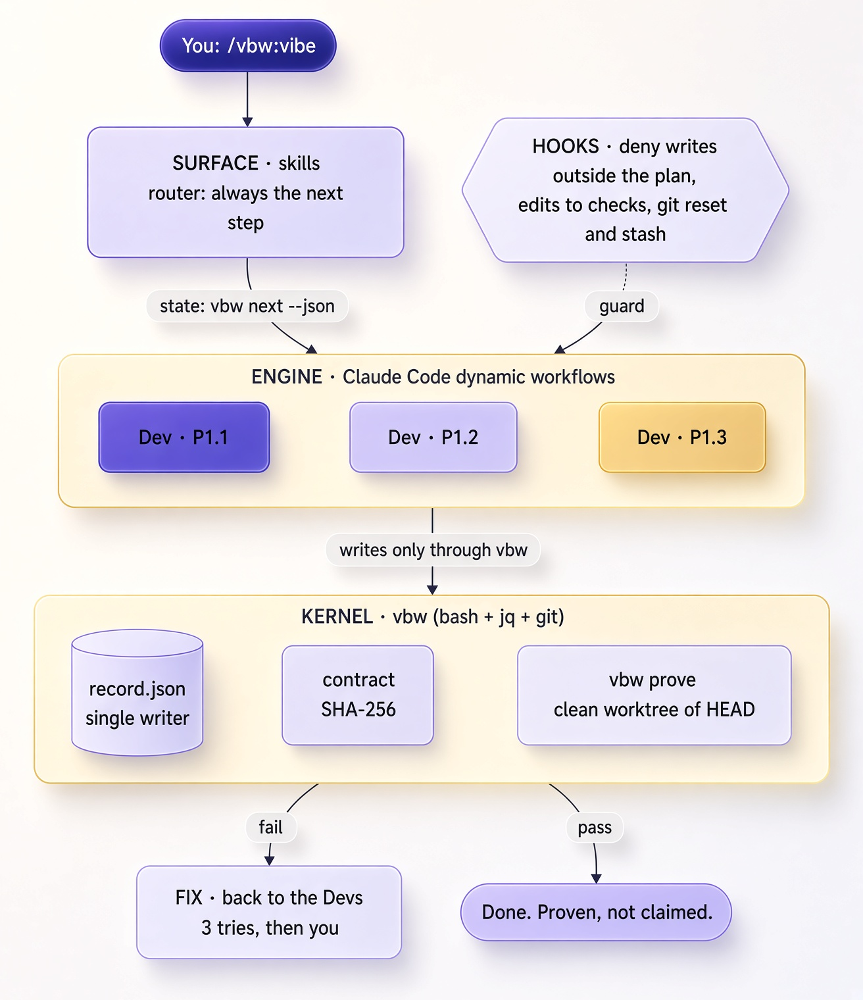

<div align="center">

# Vibe Better With Claude Code - VBW

**Requires Claude Code 2.1.286 or newer, running Sonnet, Opus or Fable.**

*You're not an engineer anymore.*

*You're a prompt jockey with commit access.*

*At least do it properly.*


[](LICENSE)
[](https://code.claude.com)
[](https://anthropic.com)
[](https://discord.gg/zh6pV53SaP)

</div>

<p align="center">
<a href="#what-is-this">What is this</a> ·
<a href="#install">Install</a> ·
<a href="#start">Start</a> ·
<a href="#features">Features</a> ·
<a href="#commands">Commands</a> ·
<a href="#how-it-stays-safe">Safety</a> ·
<a href="#configuration">Configuration</a> ·
<a href="#requirements">Requirements</a> ·
<a href="#documentation">Docs</a>
</p>

## What Is This?

> **Platform:** macOS and Linux. Windows is not supported natively: VBW runs on bash. On Windows, run Claude Code inside [WSL](https://learn.microsoft.com/en-us/windows/wsl/install).

VBW 2.0.0 is a complete rewrite of v1, in both philosophy and execution. Token savings are now a side effect, not the core objective. VBW 1.x cut coordination overhead by 86% and cost per phase by half compared with stock Agent Teams; VBW 2 hasn't been measured yet (numbers ship with 2.1.0). [See the token savings](#token-efficiency).

### **Built for pure vibe coders and the most demanding engineers alike.**

One of them can't read code. The other can't read a room. VBW gets them both to done, and neither has to talk to the other.

VBW is not a plugin. Calling VBW a plugin is like calling a parachute a backpack: technically accurate right up until the moment it matters. VBW is a harness with superpowers, an intelligence layer on top of Anthropic's models that makes Claude a quadrillion times smarter, by the only measure that counts: it can no longer tell you it's done when it isn't. You say what you want. It builds it, then proves it works before anyone is allowed to say "done".

### The problem: 

***Vibe coders***: You've shipped an app you can't read, written by an AI you can't question, tested by no one. You know it works because the AI told you so, and the AI has never lied to you, except every time. 

***Seasoned devs***: You spent twenty years writing tests nobody ran for specs nobody approved, and now you're able to trust 4,000 lines a robot wrote in the time it took you to find your reading glasses. 

### What VBW does about it:

You type `/vbw:vibe` and what you want. VBW runs this loop and stops only when it needs you. Senior devs will call this an orchestration layer. Vibe coders will call it the button. Both are right, and only one of them will admit they press it all day.

**Meet the team.** Each is an AI agent with one job; several can run at once.

| Agent | Job | How many |
| :--- | :--- | :--- |
| **Architect** | The one you talk to. Asks you the decisions that matter, then splits the work into **phases** (a goal each). The rest of the team has only heard about you. | 1 |
| **Lead** | Turns each phase into small **plans**: a few tasks, their own files. Writes the tests first and makes sure they fail today (*red*). | 1 |
| **Dev** | Writes the code for one plan, one commit per task, until its tests pass (*green*). Also fixes what fails later. | 1 per plan, in parallel |
| **QA** | Reads a finished phase against its goal and reports what's wrong. Never touches the code. | 1 per phase, in parallel |
| **Scout** | Looks things up, one angle each: your code, the web, the docs. Reports with sources; changes nothing. | up to 4 |
| **Debugger** | Reproduces a bug, finds the root cause, then makes the smallest fix plus a test that proves it. | 3 to investigate, 1 to fix |
| **Docs** | Writes the README, guides and changelog. Documentation files only. | 1 per documentation plan |


**Who's the boss?** No agent. The Lead's plans decide what gets built; the kernel decides who builds it: how many Devs run at once (as many as there are plans that share no files) and how much checking each phase gets (one Dev for a typo, the full team for your payments code). Management by a program. No feelings, no favourites, no all-hands.

```text
  STEP                                        PRACTICE
  ┌──────────────────────────────────────┐
  │ /vbw:vibe                            │
  │ First run: sets up .vbw/, asks you   │
  │ 3 questions. Existing code: maps it. │
  └──────────────────────────────────────┘
                     │
                     ▼
  ┌──────────────────────────────────────┐
  │ 1. AGREE                             │    ATDD / Specification by Example
  │ Spec: requirements, each marked      │    Acceptance criteria written
  │ [auto] (a check decides) or [human]  │    before design. Decisions
  │ (you decide). Decisions asked one    │    recorded with their rationale.
  │ at a time.                           │
  └──────────────────────────────────────┘
                     │
                     ▼
  ┌──────────────────────────────────────┐
  │ 2. PLAN                              │    TDD: red
  │ Lead splits each phase into small    │    Every [auto] requirement gets
  │ plans with disjoint files. Writes a  │    an acceptance check (argv, exit
  │ check per [auto] requirement and     │    code), confirmed failing today
  │ runs it: it must fail.               │    for the right reason.
  └──────────────────────────────────────┘
                     │
                     ▼
  ┌──────────────────────────────────────┐    ┌─────────────────────────┐
  │ 3. APPROVE                           │    │ "Not yet": the plan     │
  │ You approve one contract: spec,      │ ◀──│ changes, you're asked   │
  │ plans, checks, check-file bytes.     │    │ again                   │
  │ Any change to it un-approves it.     │    └─────────────────────────┘
  └──────────────────────────────────────┘    Frozen contract (SHA-256).
                     │                        Check files write-protected
                     │                        by hooks during build and fix.
                     ▼
  ┌──────────────────────────────────────┐
  │ 4. BUILD                             │    TDD: green
  │ Devs build plans in parallel waves,  │    Red verified before the first
  │ each only in its own files. One      │    change. Atomic commits with a
  │ commit per task.                     │    VBW-Plan: provenance trailer.
  └──────────────────────────────────────┘
                     │
                     ▼
  ┌──────────────────────────────────────┐    ┌─────────────────────────┐
  │ 5. PROVE                             │    │ FIX                     │
  │ The kernel runs every approved check │─ ─▶│ Agents fix the code,    │
  │ and the test command on a clean      │fail│ never the checks.       │
  │ copy of HEAD, and checks each commit │ ◀──│ 3 failed attempts: it   │
  │ stayed in its plan's files.          │    │ comes to you.           │
  └──────────────────────────────────────┘    └─────────────────────────┘
                     │                        Executable definition of done.
                     │                        Proof in a detached worktree,
                     │                        evidence in .vbw/record.json.
                     ▼
  ┌──────────────────────────────────────┐    ┌─────────────────────────┐
  │ 6. REVIEW                            │    │ Findings become fixes   │
  │ QA reviews against the goal and      │─ ─▶│ (back to FIX)           │
  │ changes nothing. You judge the       │    └─────────────────────────┘
  │ [human] requirements.                │    Goal-backward review.
  └──────────────────────────────────────┘    Manual acceptance testing.
                     │
                     ▼
  ┌──────────────────────────────────────┐
  │ 7. SHIP                              │    Regression suite
  │ More to build: /vbw:vibe again.      │    Every later proof covers every
  │                                      │    check: re-run if its files
  │                                      │    changed, reused if not.
  │                                      │    Nothing proven breaks quietly.
  └──────────────────────────────────────┘
```

Every stop ends with one line, **What I need from you:**, and the one thing you must do now, or "nothing". You will never again wonder whether the AI is waiting for you.

It's the entire software development lifecycle, except the engineering team is a plugin and the QA department is a program that has never once been talked into anything.

### For engineers: the model proposes, the kernel disposes

VBW 2 is built around a **kernel**: `vbw`, a small bash + `jq` + `git` program that the model cannot argue with. Agents do the work; the kernel decides what counts. It's acceptance test-driven development, enforced by code instead of good intentions.

| | Claude Code on its own | Claude Code + the VBW kernel |
| :--- | :--- | :--- |
| **Who says it's done** | The model | The exit code of an approved check, run on a clean copy of `HEAD` |
| **Who can edit the tests** | Anyone, including the agent being tested | Nobody after approval: SHA-256 contract, enforced by hooks |
| **Where the state lives** | The chat context, until compaction eats it | `.vbw/record.json`: one writer, locked, validated, atomic |
| **Who runs the process** | The model, improvising | Dynamic workflows: deterministic JavaScript |
| **Parallel agents** | Hope | Waves with no shared files; guards deny writes outside each plan |
| **Running repo commands** | Whatever the model types | Argv only, no `eval`, after you consent to the content hash |
| **Several sessions, one folder** | Last write wins | A run's files are leased to its session; everything else stays open |


<p align="center"></p>

Two design choices worth knowing:

- **No per-agent worktrees, on purpose.** A worktree has no `node_modules` or virtualenv, so an agent either reinstalls everything or proves the main checkout's code instead of its own. A false proof is the one failure VBW refuses to have. File-disjoint waves plus guards give the same isolation without it.
- **Proof reuses what didn't change.** A check whose files, definition and last result are unchanged keeps its pass; `vbw prove --full` re-runs everything.

How many agents? One per plan in a wave, and VBW keeps the wave as wide as the file boundaries allow. The theoretical ceiling is your token budget. Somewhere right now, a college freshman is running 140 VBW sessions on his trust fund to build Uber for houseplants. The idea is garbage, but it was built once, proven once, and cost less than watching plain Claude Code rebuild it five times. VBW can't fix a bad startup idea, but it makes it work.

### **Think of it as project management for the post-dignity era of software development.**

Inspired by **[Ralph](https://github.com/frankbria/ralph-claude-code)** and **[Get Shit Done](https://github.com/glittercowboy/get-shit-done)**, however, an entirely new architecture.

---

## Install

Open Claude Code and run these two commands inside the session, **one at a time**:

**Step 1:** Add the marketplace

```text
/plugin marketplace add swt-labs/vibe-better-with-claude-code-vbw
```

**Step 2:** Install the plugin

```text
/plugin install vbw@vbw-marketplace
```

Two commands, two separate inputs. Paste them together and Claude Code reads them as one command, the URL breaks, and you'll blame us.

Restart Claude Code. VBW turns on what it needs (Dynamic workflows and its status line) the first time you use it. `/vbw:doctor` checks the rest. To update later: `/vbw:update`.

### Running VBW

| | **Supervised** (for the cautious) | **Auto** (for the brave) |
| :--- | :--- | :--- |
| **Start with** | `claude` | Sonnet, Opus or Fable, then Shift+Tab for auto mode |
| **Claude Code asks you** | Before file writes and commands, once per tool per project | Only when it must |
| **VBW stops for** | Decisions, approval, checking, shipping | Decisions, approval, checking, shipping |
| **Feels like** | Some clicking in the first session, then smooth | Agents keep building until the work is done or your budget isn't |

Most vibe coders run auto mode: the agents work longer, the flow stays unbroken, and you get to pretend you're supervising while scrolling Twitter.

> **Disclaimer:** `--dangerously-skip-permissions` is called that for a reason. It is not called `--everything-will-be-fine`. VBW's guards are guard rails, not a sandbox; the Claude Code sandbox and permission rules remain the security boundary. You are trusting software written by an AI, managed by an AI, and checked by a program an AI also wrote. If that doesn't concern you, you are exactly the target audience for this plugin.

---

## Start

You only need to remember one command. In any git repository, new or existing:

```text
/vbw:vibe I want a command-line expense tracker in Node.js
```

1. **Setup.** The first run sets up the project and the VBW status line.
2. **Questions.** Three about you, once. Then the decisions that matter, one at a time.

   

3. **Approve.** Enter approves; **Not yet** or your own words change the plan. Seniors: you'll skim. They're short so skimming is enough.

   

4. **Build and prove.** Agents build in parallel, then VBW runs the checks.

   

Come back any time and type `/vbw:vibe`: it continues where things stand. Used an earlier VBW in this project? VBW reviews the old folder and recommends converting or starting fresh; you choose ([docs/convert.md](docs/convert.md)).

---

## Features

The loop above is the core. Around it:

| Feature | What you get |
| :--- | :--- |
| **Triage** | Every new idea is sorted into now, next or later, with a size. You confirm or overrule in one menu. [docs/triage.md](docs/triage.md) |
| **What's next** | After each ship, and whenever you ask, the Architect recommends a top pick and up to two runners-up, each with a reason and a size. [docs/whats-next.md](docs/whats-next.md) |
| **Decisions, recorded** | Cost, where data lives, security, anything hard to undo: asked one at a time with a recommendation, recorded with your reason. Six months from now, when someone asks "who decided this?", git will say it was you. |
| **Rigor that fits** | A typo gets one Dev and one approval. Your billing code gets research, a full team and deep review. VBW sizes the process from what the work touches, raises the bar when a build goes badly, and tells you why. [docs/rigor.md](docs/rigor.md) |
| **Talks at your level** | Three questions, once per project. Beginners get plain words. Seniors get terse output and the trade-offs, which is what they'd have asked for if they ever read the docs. |
| **Picks up where you left off** | Everything lives in `.vbw/` in your project, not in a chat window. Disappear for a weekend of pretending you have hobbies; `/vbw:vibe` continues exactly where things stand. |
| **Status line and panel** | Progress, what's proven and what VBW needs from you, after every response. On Claude Code 2.1.287+, a panel says in plain words what VBW is doing, with an optional sound when it needs you. [docs/panel.md](docs/panel.md) |


Everything a senior engineer would track on a whiteboard, except the whiteboard is now a terminal and the senior engineer is now you.

---

## Commands

You need one: `/vbw:vibe`. The rest exist for people who like to feel in control.

| When | Command | What it does |
| :--- | :--- | :--- |
| **Always** | `/vbw:vibe [what you want]` | The next step, every time. This is the whole product |
| **Deciding** | `/vbw:approve` | Approve the plan and its checks. Only you can |
| | `/vbw:discuss`, `/vbw:research` | Think a decision through; get a sourced answer to a question |
| | `/vbw:todo [idea]`, `/vbw:list-todos` | Park an idea; see the list. Where "we should really..." goes instead of dying in a terminal tab |
| **Checking** | `/vbw:status` | Where the project stands |
| | `/vbw:qa`, `/vbw:verify` | Run every check now; judge what only you can |
| | `/vbw:debug [problem]`, `/vbw:fix [what]` | Root cause from three angles at once; a quick fix with every check re-run, for when you don't need seven agents to add a comma |
| **Existing code** | `/vbw:map`, `/vbw:teach [convention]` | Map the codebase; teach VBW your conventions |
| | `/vbw:init`, `/vbw:convert` | Set up VBW (vibe does it too); bring in a project from an earlier VBW |
| **Session** | `/vbw:pause`, `/vbw:resume` | Stop safely; pick up where you left off |
| | `/vbw-status`, `/vbw-why`, `/vbw-todo [idea]` | Instant, even mid-run, no model turn: where things stand; who holds the run and why; park an idea |
| | `/vbw:panel`, `/vbw-panel`, `/vbw-sound` | Does the panel work here; open Mission Control; sound on or off ([docs/panel.md](docs/panel.md)) |
| **Setup** | `/vbw:profile`, `/vbw:config` | How VBW works in one go; one setting at a time |
| | `/vbw:skills`, `/vbw:rtk`, `/vbw:compress` | Find the best tools for your project ([docs/tools.md](docs/tools.md)); compress command output; terser instruction files |
| | `/vbw:help`, `/vbw:doctor`, `/vbw:report` | List the commands; check the setup; prepare a bug report |
| | `/vbw:update`, `/vbw:whats-new`, `/vbw:uninstall` | Stay current, or remove VBW and go back to prompting manually like it's 2024 |

---

## Who Works When

The team is in [What VBW does about it](#what-vbw-does-about-it); their specifications are in [`plugin/agents/`](plugin/agents/).

| Workflow | Started by | Who runs |
| :--- | :--- | :--- |
| Planning | `/vbw:vibe` at the plan step | Architect (decisions) → Architect (scope) → Lead |
| Building | `/vbw:vibe` at the build step | a Dev per ready plan (Docs for documentation), in parallel |
| Fixing | `/vbw:vibe` when a check fails | a Dev per group of related fixes, in parallel |
| Verifying | `/vbw:vibe` after the checks pass | a QA agent per built phase, in parallel |
| Mapping | `/vbw:map`, or planning on existing code | a Scout per angle, then one merged map |
| Researching | `/vbw:research` | four Scouts, then one sourced answer |
| Investigating | `/vbw:debug` | three Debuggers (reproduce, trace, history), one diagnosis, then one fix |
| Recommending | `/vbw:vibe` after a ship, or when you ask what's next | the Architect, once |

Full reference: [docs/workflows.md](docs/workflows.md).

---

## How It Stays Safe

| What could go wrong | What stops it |
| :--- | :--- |
| An agent runs `rm -rf`, force-pushes or `git reset --hard` | Guards check every command before it runs, and read what the shell would actually execute: `git commit -m "never rm -rf /"` passes, `sh -c 'rm -rf .'` doesn't |
| An agent opens your `.env` or your keys | Guards block secret files. VBW never handles secrets |
| An agent writes outside its part of the plan | Guards deny it |
| The AI approves its own plan | It can't, however creatively it spells the command. Approval lives in your clone's `.git` folder, so a repository you download can't approve itself |
| An agent edits a test until it passes | Approved checks are frozen while building. If the code doesn't pass, the code changes. Revolutionary, we know |
| Nobody knows who changed what | Every change is committed with the requirement it serves. `git log` reads like an audit, not a crime scene |

How it's enforced: [For engineers](#for-engineers-the-model-proposes-the-kernel-disposes). Every rule and why it exists: [docs/guards.md](docs/guards.md).

---

## Configuration

Three presets cover most people. `/vbw:profile` switches them; `/vbw:config` changes one setting at a time.

| Preset | Models | Autonomy | Good for |
| :--- | :--- | :--- | :--- |
| **Careful** | `quality`: Opus for Architect, Lead, Dev and Debugger | `guided`: explains each step and waits for "go" | Learning, a first project, risky changes |
| **Standard** | `balanced`: Opus for the Architect and the Lead, Sonnet for the rest | `balanced`: keeps going, stops for decisions, approval, checking and shipping | Most work (the default) |
| **Fast** | `budget`: Haiku for Scout, Sonnet for the rest | `hands-off`: takes its own recommendations and lists them for you | Small changes, once you trust it |

Approval, checking and shipping always stop for you, whatever the preset. Autonomy controls friction, not safety.

| Setting | Values | What it does |
| :--- | :--- | :--- |
| `profile` | `quality` / `balanced` / `budget` | Which models the agents run on |
| `model.<role>` | `opus` / `sonnet` / `haiku` / a model id / `default` | Override one agent. QA never runs on Haiku: whatever judges your work doesn't get the cheap seat |
| `autonomy` | `guided` / `balanced` / `hands-off` | How much `/vbw:vibe` does on its own |
| `autonomy_cap` | a number | Steps one autonomous run takes before stopping |
| `rigor` | `auto` / `express` / `standard` / `deep` | How thorough each phase is: sized to the work (`auto`, the default) or forced |
| status line | `vbw statusline on` / `off` | The status line |

Your own session keeps the model you chose with `/model`; it must be Sonnet, Opus or Fable for auto mode.

---

## Project Structure

```text
your-project/.vbw/
  spec.md        What you want, in plain words. You own this file
  record.json    The plan of record: phases, plans, checks, results. Only the kernel writes it
  map.md         The map of your codebase, when there is existing code

plugin/
  bin/vbw        The kernel: decides the next step, runs the checks, keeps the record
  lib/           Kernel libraries (bash, jq, git)
  workflows/     Planning, building, fixing, verifying, mapping, researching, investigating
  agents/        Architect, Lead, Dev, QA, Scout, Debugger, Docs
  skills/        /vbw:vibe and every other command
  hooks/         The guards
  scripts/       The status line
```

Your AI-managed project now has more structure than most startups that raised a Series A.

---

## Requirements

| You need | Why |
| :--- | :--- |
| **Claude Code** 2.1.286+ (2.1.287+ for the panel) | Dynamic workflows and the hooks VBW runs on |
| A **Sonnet, Opus or Fable** session | Auto mode; workflow agents may also use Haiku |
| **`jq`** and **`git`** | The kernel. `brew install jq` (macOS) or `apt install jq` (Linux) |
| A git repository, new or existing | Everything VBW does is committed |
| The willingness to let an AI build your software and a program check its homework | This is the real barrier to entry |

`/vbw:doctor` checks all of it.

---

## Token Efficiency

> **Coming soon.** VBW 2's token and cost analysis ships with **2.1.0**.

### VBW 1.x vs stock Opus 4.6 Agent Teams

*Legacy measurements from VBW 1.x.*

Every capability was shell-only: 85 scripts ran as bash subprocesses at zero model token cost. The codebase grew 42% since v1.21.30 while per-request overhead grew just 12% (still 7% below v1.20.0). 845 bats tests validated the stack.

**Analysis reports:** [v1.30.0](https://github.com/swt-labs/vibe-better-with-claude-code-vbw/blob/main/docs/vbw-1-30-0-full-spec-token-analysis.md) | [v1.21.30](https://github.com/swt-labs/vibe-better-with-claude-code-vbw/blob/main/docs/vbw-1-21-30-full-spec-token-analysis.md) | [v1.20.0](https://github.com/swt-labs/vibe-better-with-claude-code-vbw/blob/main/docs/vbw-1-20-0-full-spec-token-analysis.md) | [v1.10.7](https://github.com/swt-labs/vibe-better-with-claude-code-vbw/blob/main/docs/vbw-1-10-7-context-compiler-token-analysis.md) | [v1.10.2](https://github.com/swt-labs/vibe-better-with-claude-code-vbw/blob/main/docs/vbw-1-10-2-vs-stock-agent-teams-token-analysis.md) | [v1.0.99](https://github.com/swt-labs/vibe-better-with-claude-code-vbw/blob/main/docs/vbw-1-0-99-vs-stock-teams-token-analysis.md)

| Category | Stock Agent Teams | VBW 1.x | Saving |
| :--- | ---: | ---: | ---: |
| Base context overhead | 10,800 tokens | 1,500 tokens | **86%** |
| State computation per command | 1,300 tokens | 200 tokens | **85%** |
| Agent coordination (x4 agents) | 16,000 tokens | 1,200 tokens | **93%** |
| Compaction recovery | 5,000 tokens | 700 tokens | **86%** |
| Context duplication (shared files) | 16,500 tokens | 900 tokens | **95%** |
| Agent model cost per phase | $2.78 | $1.40 | **50%** |
| **Total coordination overhead** | **87,100 tokens** | **12,100 tokens** | **86%** |

| Scenario | Without VBW | With VBW 1.x (Balanced) | Impact |
| :--- | ---: | ---: | ---: |
| API: single project (10 phases) | ~$28 | ~$14 | **~$14 saved** |
| API: active dev (20 phases/mo) | ~$56/mo | ~$28/mo | **~$28/mo saved (~$336/yr)** |
| API: heavy dev (50 phases/mo) | ~$139/mo | ~$70/mo | **~$69/mo saved (~$828/yr)** |
| API: team (100 phases/mo) | ~$278/mo | ~$139/mo | **~$139/mo saved (~$1,668/yr)** |
| Pro / Max subscription | baseline capacity | ~3x phases per cycle | **200% more work done** |

*Based on [API pricing](https://claude.com/pricing) at the time of each report.*

---

## Documentation

| Read | To understand |
| :--- | :--- |
| [docs/proof.md](docs/proof.md) | Requirements, checks, approval and proof |
| [docs/next.md](docs/next.md) | How VBW decides the next step |
| [docs/rigor.md](docs/rigor.md) | How VBW sizes the process to the work |
| [docs/workflows.md](docs/workflows.md) | The team and the workflows |
| [docs/guards.md](docs/guards.md) | The safety guards |
| [docs/interview.md](docs/interview.md) | The questions about you, and how they shape every message |
| [docs/record.md](docs/record.md) | The plan of record (`.vbw/record.json`) |
| [docs/statusline.md](docs/statusline.md), [docs/panel.md](docs/panel.md) | The status line and the panel |
| [docs/diagnostics.md](docs/diagnostics.md) | `vbw report` for bug reports, and `vbw rtk` |
| [docs/tools.md](docs/tools.md) | Finding the best tools for your project (nothing installed without your approval) |
| [docs/convert.md](docs/convert.md) | Coming from an earlier VBW |
| [plugin/CHANGELOG.md](plugin/CHANGELOG.md) | What changed |

---

## Contributing

VBW is open source because the best tools are built by the people who use them. The kernel, the workflows, the agents, the guards: all of it is open to improvement. Found a better way to plan, build or prove code with Claude? File an issue, open a PR, or **[join the Discord](https://discord.gg/zh6pV53SaP)**.

Tests: `bash tools/test.sh` (macOS bash 3.2 and bash 5). Local development and pull requests: [CONTRIBUTING.md](CONTRIBUTING.md).

[](https://github.com/swt-labs/vibe-better-with-claude-code-vbw/graphs/contributors)

## License

MIT, see [LICENSE](LICENSE).

Built by people who stopped trusting AI the day it first said "done".
