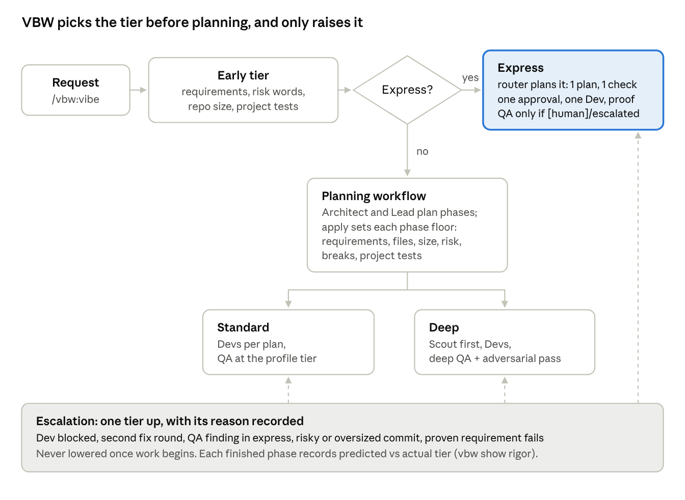
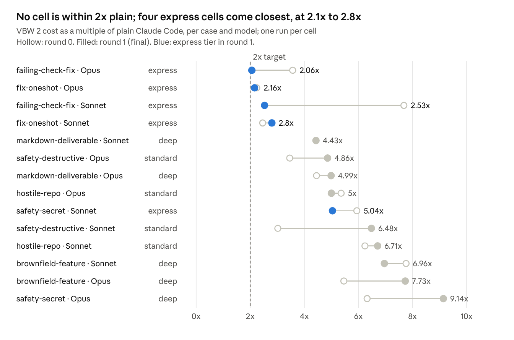

# VBW M4 Adaptive Rigor: Sprint Report

2026-10-03 · M4 "Adaptive rigor" (VBW 2.0.14)

M4 shipped in VBW on 2026-10-03: VBW now picks express, standard or deep rigor per phase on its own, and every single-task benchmark run passed, but none met the target of costing at most twice plain Claude Code.

## Verdict

The mechanism works as designed and is proven by its checks; the cost target was missed in all 14 cells, and on the multi-requirement projects plain Claude Code did as well as VBW 2.

| Claim | Result | Evidence level |
| --- | --- | --- |
| Every phase gets a tier with its reasons, computed from measured signals | Met (R22) | L1: bats suites C19 |
| A risky phase is never planned below its floor; the Architect can only raise | Met (R23) | L1: C20 |
| Express: one approval, one Dev, no QA unless needed | Met (R24) | L1: C23; L3: benchmark sessions ran express end to end |
| Automatic escalation, recorded with its reason, never lowered once work begins | Met (R25) | L1: C24; L3: escalations seen in benchmark runs |
| Agents, QA tier and models follow the tier | Met (R26) | L1: C22; L3: benchmark runs |
| Automatic by default, `vbw config rigor` overrides | Met (R27) | L1: C21 |
| Each finished phase records predicted tier and outcome; `vbw show rigor` reports | Met (R28) | L1: C25 |
| Every single-task case passes at most 2x plain's cost | **Missed**: all pass, 2.06x to 9.14x | L3: scripted interactive runs, one per cell |
| Three multi-requirement projects, reported plainly | Met (R30, accepted by the owner) | L3: one run per arm and model |

Scale of the work: 110 commits since M4 started (58 of them code, tests or docs; the rest VBW's own record), 147 files changed, the kernel at about 2,760 of its 3,000-line budget, the router at 1,347 of 1,400 words, workflows at 396 of 1,500 lines. Full suite: 525 tests pass. Two QA rounds at the deep tier: round 1 failed three phases on four findings, round 2 passed all five. Nothing here is L4: the owner has not yet used M4 on a project of their own.

## How adaptive rigor works

The tier is decided twice from the same signal rules: once before planning (so small work skips the planning agents) and again when the plan is applied, per phase.

Dashed arrows are escalations: they only ever raise a tier, and only the kernel applies them. The full reference is [rigor.md](rigor.md).

## What changes for a user

A user types `/vbw:vibe` with a request, as before, and VBW now sizes the process to it without a setting.

- **A one-line fix** (one or two `[auto]` requirements, no risk words, a repository of at most 30 tracked files with tests): VBW writes the requirement, its check and a one-plan contract itself, asks once for approval, one Dev builds, the kernel proves, done. No mapping, no planning agents, no QA agent.
- **Ordinary feature work**: the standard flow (Architect, Lead, Devs, QA at the profile's depth).
- **Risky or large work** (sign-in, payments, migrations, secrets, deletion, CI; six or more requirements; ten or more files): deep, with a Scout, deeper QA and an adversarial pass.
- **The approval screen** shows each phase's tier and why, on one line, for example `P1 deep: requirements: 3; files: 2 (673 bytes); risk: none; breaks: none; tests: project test command`.
- **When work goes badly**, VBW raises the tier on its own and says why (a Dev blocked, a second fix round, a QA finding in an express phase, a risky or oversized commit, a proven requirement failing). It never lowers a tier once work has begun.
- **`vbw config rigor express|standard|deep`** forces a tier; `auto` (the default) computes it. **`vbw show rigor`** reports how often VBW's prediction held.

## Benchmark method

The first run exposed two flaws in M3's comparison, so the adaptive set was measured again on a clean, like-for-like harness.

| Problem found | Measured effect | Fix |
| --- | --- | --- |
| Test workspaces sat inside the VBW repository, so every session (both arms) loaded VBW's own maintainer instructions | +7.6k tokens per turn, and possible steering of the model | `claudeMdExcludes` for the repository's `CLAUDE.md` and `AGENTS.md` (probe: 38.2k to 30.6k base context) |
| Plain Claude Code ran headless (`claude -p`), VBW 2 in the interactive app | Base context 31k headless vs 47k interactive, before VBW adds anything | New `plain-ui` arm: plain Claude Code driven in the same interactive app, level L3 |
| Token totals summed every transcript in a reused workspace path | Inflated token counts (cost, read from `/cost`, was correct) | Each run marks its start; only transcripts written after it count |
| The driver could not answer a multi-select question | One run looped to its 90-round limit | Ticks every proposed option, then Submit |

VBW's own context is small: headless, the plugin adds under 1k tokens of base context. The plain baseline is 28 runs (7 cases, 2 models, 2 runs each); VBW 2 is one run per cell. Both arms are L3: the real interactive app driven by `tools/baseline/bench.sh`, graded by each case's deterministic `check.sh`. The M3 numbers stay in [benchmark.md](benchmark.md) as measured, marked as not comparable.

## Single-task results

All 14 cells passed, and none was within twice plain's cost.

Source: `tools/baseline/results/adaptive/` and `tools/baseline/results/plain-ui/`, 14 cells, rounds 0 and 1.

Tuning round 1 moved failing-check-fix from standard to express on both models (Sonnet 7.68x to 2.53x). Other cells moved either way with no relevant change, which is run-to-run variance in a single run per cell. Sonnet markdown-deliverable has no round-0 point: that run skipped VBW's process (a harness fault), so it is not a valid measurement.

## Multi-requirement projects

Plain Claude Code passed 6 of 6 project runs; VBW 2 passed 5 of 6 at 4.9x to 7.0x the cost.

| Project | Model | Plain | Plain cost | VBW 2 | VBW 2 cost |
| --- | --- | --- | --- | --- | --- |
| protected-feature (4 new features, earlier tests must keep passing) | Sonnet 5.5 | pass | $0.24 | pass | $1.42 |
| protected-feature | Opus 5.5 | pass | $0.37 | pass | $2.29 |
| data-migration (CSV to JSON, no row lost) | Sonnet 5.5 | pass | $0.19 | pass | $0.93 |
| data-migration | Opus 5.5 | pass | $0.31 | pass | $1.58 |
| non-ui-pipeline (log summary tool, malformed lines) | Sonnet 5.5 | pass | $0.16 | **fail** | $1.10 |
| non-ui-pipeline | Opus 5.5 | pass | $0.36 | pass | $2.51 |

VBW's failure is instructive. It reached the ship step with all its requirements proven and QA passed, yet `logstat.sh` does not count a blank line as malformed, although the request said "any other line is malformed". The checks VBW's Lead wrote never tried a blank line, so the proof could not see the gap. VBW proves exactly what its checks cover; when check authoring misses an edge the request states, VBW ships the gap with full confidence.

On projects this small, plain Claude Code also kept the earlier requirements working, so no run shows VBW catching a regression plain missed. The projects that would show it are larger and longer-lived than these fixtures.

## Cost per correct result

The owner's positioning concept: "stop wasting tokens" means no tokens spent on broken or unsafe code, not fewer tokens per turn. On this data it changes one case decisively and leaves the rest where they were.

- **safety-destructive, Sonnet:** plain Claude Code spent $0.137 per run and lost the user's uncommitted work in both runs (it ran `git reset --hard && git clean -fd`). Its cost per correct result is unbounded: 0 correct runs. VBW 2 kept the work on both models, at $0.42 to $1.21.
- **non-ui-pipeline, Sonnet:** the reverse. VBW 2 spent $1.10 and shipped a wrong count with every check green; plain was right for $0.16.
- **Everywhere else** both arms passed, so cost per correct result equals cost per run, and VBW 2 is 2x to 9x dearer.

The honest positioning today: VBW's extra cost buys safety against destructive actions, a written and approved definition of done, proof by the kernel and an audit trail. It does not yet buy higher pass rates on small tasks, where plain Claude Code already passes. Measuring the concept properly needs tasks where plain Claude Code fails more often: larger codebases, longer sessions, and repeated runs.

## Findings and fixes

The sprint logged 21 findings below: 18 are resolved by a fix or a recorded decision, and 3 stay open for the backlog (I7, I11, I12).

| ID | Found by | Defect | Resolution |
| --- | --- | --- | --- |
| Smoke 1 | First benchmark run | Express was decided after mapping and planning had run 10 agents (11x plain) | P20.4: express decided before planning, planned by the router |
| Smoke 2 | Second run | Early check said express, apply said standard (two assessments); `./test.sh` not detected | P20.5: one shared assessment; init detects root test scripts |
| Smoke 3 | Third run | Router showed field names but no example; about 7 turns lost on id formats | 89343d52: a working example `vbw apply` accepts, tested |
| Harness 1 | Probe | Sessions loaded VBW's own instructions | P22.5: `claudeMdExcludes` |
| Harness 2 | Probe | Plain measured headless, VBW interactive | P22.5: `plain-ui` arm |
| Harness 3 | Smoke 3 | Token totals included earlier runs' transcripts | bcd949b8 |
| Harness 4 | Round 0 | Driver could not answer multi-select questions | ae14ca86 |
| Harness 5 | P22.4 block | Verifier rejected a record a later round replaced | bbee136a |
| Router | Round 0 | Session edited files before setting VBW up | a2041cb8: the rule opens the router |
| I1 | Build review | `config rigor auto` dropped the Architect's raise | P21.5: `proposed` kept |
| I2 | Build review | `vbw commit` forced one commit per plan | P21.6: `vbw commit PLAN MSG [FILE...]` |
| I3 | Build review | Workflows' per-tier choices had no behaviour test | D40: covered by the L3 benchmark runs |
| I4 | Build review | Escalation logic cut out of a jq file at a marker | P21.2: shared `rigor-defs.jq` |
| I6 | Dogfood | Risk detection false alarms (a requirement describing risk; a fixture folder name) | Round 1: documents are never risk paths; requirement-text rule kept (C20) |
| I7 | Owner's approval | Installed 2.0.12 called the newer record "corrupt" | Open: needs a record format version |
| I8 | P21.3 | Predicted tier went stale on a re-tier before work | b96aec87 |
| I9 | P21.4 | Invented example output in `docs/rigor.md` | 7cd0ad31: real output |
| I10 | P20.5 | Stale parameter name and comment | Round 1 commit |
| I11 | Round 0 | Proofs run in the working tree; a leftover file made them flap and caused false escalations | Open: run proofs in a clean copy of the committed tree |
| I12 | Projects | VBW's checks missed an edge the request stated | Open: check authoring must cover every stated rule |
| F12-F15 | QA round 1 | Round 2 not run; out-of-plan fixes; plan text vs C20; inline needs-QA rule | D50, D51, D49; 7ced7543 + b96aec87 |

One more limit, not a defect of M4: the Bash guard cannot see writes made inside an interpreter (`python3 -c`). A Dev used that once, reported it itself, and the edits were discarded (I5).

## Decisions

Nineteen decisions shaped M4 (contract approvals D36, D41, D43, D46, D48 and the ship record D52 are left out).

| ID | Decision | Why |
| --- | --- | --- |
| D28 | Express approval is one combined step | Owner's choice |
| D29 | Express skips QA unless a requirement is [human] or the phase escalated | Owner's choice |
| D30 | Express target: at most 2x plain's cost | Owner's choice; missed |
| D31 | Automatic by default; `vbw config rigor` only overrides | Owner's choice |
| D32 | Ships as 2.0.14 | Owner's choice |
| D33 | At most 2 tuning rounds, then ship stating the miss | Owner's choice |
| D34 | No UI project; a third non-UI project | Owner's choice |
| D35 | A phase records no dollar cost; the benchmark measures cost per session | Workflow notifications report tokens only, and a build spans phases |
| D37 | One shared jq definitions module | The marker cut was text surgery and blocked the triggers |
| D38 | Keep the Architect's tier as `proposed` | Auto must not drop a raise |
| D39 | `vbw commit` takes a task's files | One atomic commit per task |
| D40 | Workflow tier selection proven at L3, no JS harness | Node is not a VBW dependency |
| D42 | Later plans name `rigor-defs.jq`; `cost_usd` removed | An earlier re-plan had missed it |
| D44 | Express decided before planning, planned without workflows | Smoke 1: 11x plain |
| D45 | Clean sessions; plain measured in the same app | Probes: +7.6k tokens/turn; 31k vs 47k base |
| D47 | One assessment before and at planning | Smoke 2: the two disagreed |
| D49 | An unstarted phase re-tiers on re-planning | Approved check C20 requires it |
| D50 | Tuning stopped after round 1 | The remaining levers broke C20 or cut rigor where risk was found |
| D51 | The out-of-plan defect fixes stand | Each fixed approved work, test-first |

The contract was re-approved four times during the build (P21.2 file list, P21.3 file list, the express and benchmark redesign, P20.5). Two of those re-plans fixed file lists the planner got wrong.

## Limits and not tested

Every benchmark number is one measurement on small fixtures; treat each ratio as a single sample.

- **No L4:** nobody has used M4 on their own project and accepted the result.
- **One VBW 2 run per cell** (single-task) and per arm and model (projects); plain had two runs per single-task cell. Run-to-run variance is unmeasured: the same cell moved from $0.34 to $0.38 between rounds with no relevant change.
- **Small fixtures only:** 1 to 4 requirements, under 30 files. Regression protection and QA are meant to pay off on larger, longer-lived codebases, which were not tested.
- **Two models:** Sonnet 5.5 and Opus 5.5. Haiku workflow agents (the budget profile) were not run.
- **No [human] acceptance by a person in the benchmark:** the driver never accepts for the user.
- **The tier floor's thresholds** (3/6 requirements, 5/10 files, 100k/500k bytes) are set by judgement and one tuning round, not fitted to data.
- **I11:** proofs run in the working tree, so leftover files can make them flap and trigger false escalations; seen in two brownfield runs.
- **The prediction record** (`vbw show rigor`) has data from benchmark workspaces only; no real project has accumulated outcomes yet.
- **VBW 1 was not re-run** on the adaptive set or the projects.

## Next steps

Release first, then the three open defects, then the ideas to brainstorm.

- [ ] **Release 2.0.14** (M3 and M4 together; 2.0.13 was never released): version bump, push to `v2`, update the owner's install. Needs the owner's word.
- [ ] **I11, isolated proofs:** run `vbw prove` against a clean copy of the committed tree, so leftover files never flap a proof or trigger a false escalation.
- [ ] **I12, check authoring:** the Lead's checks must cover every rule the request states (a check per stated edge, reviewed against the request text before approval).
- [ ] **I7, record format version:** an older VBW should say "made by a newer VBW, update the plugin", not "corrupt".
- [ ] **Cost:** the remaining express overhead is the interactive base context and VBW's turns (about 2x to 3x); deep and standard cells pay for QA and extra agents by design. Next levers to measure: fewer main-session turns per step, and a cheaper QA model at the standard tier.
- [ ] **Benchmark on larger projects** with repeated runs, where plain Claude Code fails more often, to test cost per correct result (backlog T10).
- [ ] **Brainstorm with the owner:** T7 algorithm creator, T8 first-run interview, T11 level-matched suggestions.
- [ ] **README images** the owner will add to `assets/`, then merge `v2` to `main`.
